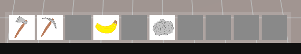

# **🎮 Survival Game Project**

Some random dev history!

Project start: martedì 28 gennaio 2025, 20:27:05

---

#### **Image from: 15/3/2025**

_Rudimental Fading/See-through shader tecnique with dithering to fade objects that are between camera and player_

#### **Image from: 13/3/2025**
_Rudimental Item collection pop-up system + working right click item splitting on inventory._

#### **Image from: 07/3/2025**
_Rudimental Chest logic and related UI._

#### **Image from: 04/3/2025**
_Improved UI components: added Building and Crafting screen._

#### **Image from: 27/2/2025**
_Some new stuff: basic health, food, thirst and energy mechanics; day mechanics (sleep etc.)_

#### **Image from: 23/2/2025**
_Rudimental ProcessingStation UI with buggy interaction with inventory!_

#### **Image from: 21/2/2025**
_Organised roadmap on Notion!_

#### **Image from: 20/2/2025**
_Rudimental Inventory and quickbar UI with drag mechanics_

#### **Image from: 10/2/2025**
_Rudimental inventory system and dropped items after resource collection_

#### **Image from: 9/2/2025**
_First screenshot!_
_Grid system + buildings placement and occupied area_
